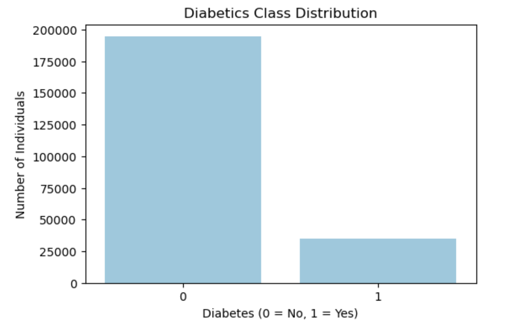
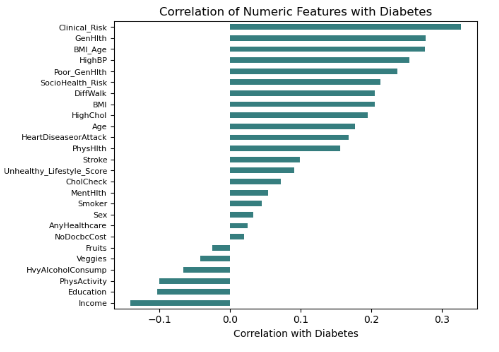
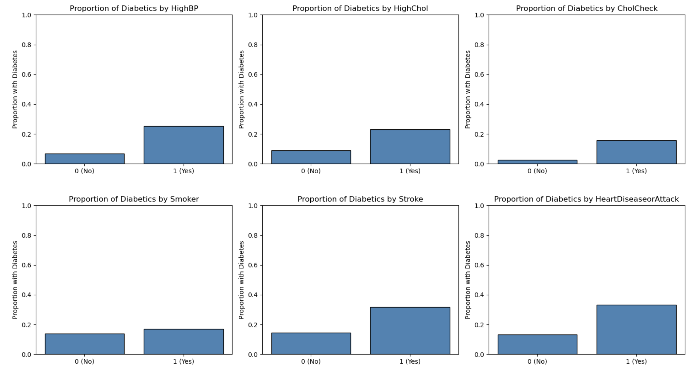

# Diabetes Prediction using Lifestyle and Health Indicators

## Overview
In today's world, due to our lifestyle and eating habits, we are increasingly prone to **diabetes**. This chronic condition not only makes life difficult but also increases the risk of many secondary diseases. Diabetes has become a global health challenge, affecting millions of people worldwide.  

To better understand this growing concern, I used a dataset on diabetes available at the **UC Irvine Machine Learning Repository**.  

The dataset captures healthcare statistics and lifestyle survey responses of people in the US, along with their diabetes status.  
The **goal** of this project is to predict whether a person has diabetes based on lifestyle and health features.

By building an accurate predictive model, we can potentially identify individuals at risk early, enabling timely interventions and better health outcomes.

---

## Objectives
1. Acquire and load the dataset.  
2. Clean and preprocess data (handle duplicates, missing values, data types).  
3. Explore numeric, binary, and ordinal columns.  
4. Perform **exploratory data analysis (EDA)** to identify imbalances, correlations, and patterns.  
5. Engineer features that capture combined risk factors.  
6. Train and tune multiple ML models: **Logistic Regression, Decision Tree, Random Forest, XGBoost, and CatBoost**.  
7. Compare models based on **ROC-AUC** scores.  
8. Select the best model and evaluate on the test set.  
9. Derive insights about health and lifestyle factors influencing diabetes.  

---

## Data Description

The dataset contains survey-based health and lifestyle indicators along with diabetes outcomes.  

| Variable Name        | Description |
|-----------------------|-------------|
| **ID**               | Patient ID (unique identifier). |
| **Diabetes_binary**  | Target variable: 0 = no diabetes; 1 = prediabetes or diabetes. |
| **HighBP**           | High blood pressure: 0 = no high BP; 1 = high BP. |
| **HighChol**         | High cholesterol: 0 = no high cholesterol; 1 = high cholesterol. |
| **CholCheck**        | Cholesterol check in past 5 years: 0 = no; 1 = yes. |
| **BMI**              | Body Mass Index (integer). |
| **Smoker**           | Have you smoked at least 100 cigarettes in your entire life? (Note: 5 packs = 100 cigarettes). 0 = no; 1 = yes. |
| **Stroke**           | (Ever told) you had a stroke. 0 = no; 1 = yes. |
| **HeartDiseaseorAttack** | Coronary heart disease (CHD) or myocardial infarction (MI). 0 = no; 1 = yes. |
| **PhysActivity**     | Physical activity in past 30 days – not including job. 0 = no; 1 = yes. |
| **Fruits**           | Consume fruit 1 or more times per day. 0 = no; 1 = yes. |
| **Veggies**          | Consume vegetables 1 or more times per day. 0 = no; 1 = yes. |
| **HvyAlcoholConsump**| Heavy drinkers: adult men having >14 drinks/week and adult women >7 drinks/week. 0 = no; 1 = yes. |
| **AnyHealthcare**    | Have any kind of health care coverage, including health insurance, prepaid plans such as HMO, etc. 0 = no; 1 = yes. |
| **NoDocbcCost**      | Was there a time in the past 12 months when you needed to see a doctor but could not because of cost? 0 = no; 1 = yes. |
| **GenHlth**          | General health (self-reported): 1 = excellent; 2 = very good; 3 = good; 4 = fair; 5 = poor. |
| **MentHlth**         | Number of days during the past 30 days when mental health was not good (includes stress, depression, and problems with emotions). Scale 1–30 days. |
| **PhysHlth**         | Number of days during the past 30 days when physical health was not good (includes physical illness and injury). Scale 1–30 days. |
| **DiffWalk**         | Serious difficulty walking or climbing stairs. 0 = no; 1 = yes. |
| **Sex**              | Sex: 0 = female; 1 = male. |
| **Age**              | Age category: 13-level age category (_AGEG5YR). Example: 1 = 18–24; 9 = 60–64; 13 = 80 or older. |
| **Education**        | Education level (EDUCA scale): 1 = Never attended school or only kindergarten; 2 = Grades 1–8 (Elementary); 3 = Grades 9–11 (Some high school); 4 = Grade 12 or GED (High school graduate); 5 = College 1–3 years (Some college or technical school); 6 = College 4+ years (College graduate). |
| **Income**           | Income scale (INCOME2): 1 = Less than $10,000; 2 = $10,000–$15,000; 3 = $15,000–$20,000; 4 = $20,000–$25,000; 5 = Less than $35,000; 6 = Less than $50,000; 7 = Less than $75,000; 8 = $75,000 or more. |
 

---

## Exploratory Data Analysis (EDA)

### Target Distribution
The dataset is **imbalanced** — majority of individuals do not have diabetes.  

---

### Correlation of Numeric Features with Diabetes
Clinical_Risk, GenHlth, and health-related indicators show notable correlations with diabetes risk.  

---

### Diabetes Proportion by Binary Features
For example:
- **High Blood Pressure:** Strongly associated with higher diabetes prevalence.   

---

## Feature Engineering
To improve predictive power, several engineered features were created:

- **BMI_Age:** `BMI * Age` → combines age with body weight factor.  
- **Clinical_Risk:** `HighBP + HighChol + HeartDiseaseorAttack + DiffWalk` → cumulative clinical risk score.  
- **Poor_GenHlth:** Binary indicator for poor general health (GenHlth ≥ 4).  
- **Unhealthy_Lifestyle_Score:** Composite score from smoking, low fruit/vegetable intake, and inactivity.  
- **SocioHealth_Risk:** Socioeconomic risk score (low education, low income, poor health).  

These engineered features showed **high correlation with diabetes**, confirming their utility.

---

## Model Development & Comparison

- Target variable imbalance handled with **class weights / auto balancing**.  
- Scaling applied to continuous + ordinal features for Logistic Regression; not required for tree-based models.  
- Hyperparameter optimization performed with **RandomizedSearchCV**.  

### Model Comparison Results

| Model               | Train ROC-AUC | Validation ROC-AUC |
|----------------------|---------------|---------------------|
| Logistic Regression  | 0.8105        | 0.8118             |
| Decision Tree        | 0.8101        | 0.8033             |
| Random Forest        | 0.8382        | 0.8146             |
| XGBoost              | 0.8215        | 0.8179             |
| **CatBoost**         | **0.8215**    | **0.8184**         |

**Best Model:** CatBoost → Validation ROC-AUC = **0.8184**

---

## Final Test Evaluation

- **Model:** CatBoost  
- **Test ROC-AUC:** **0.8125**  

CatBoost consistently outperformed other models, making it the final choice.

---

## Key Insights
- **Feature Importance:** Clinical and lifestyle risk factors such as HighBP, HighChol, BMI, and poor general health are strong predictors of diabetes.  
- **Unexpected Patterns:** Heavy alcohol consumption showed a lower proportion of diabetes, which may reflect confounding factors.  
- **Imbalance Challenge:** Class imbalance required special handling (balanced class weights).  
- **Feature Engineering Impact:** Engineered features like `Clinical_Risk` and `Unhealthy_Lifestyle_Score` boosted correlation with the target.  

---

## Business & Healthcare Impact
This model demonstrates the potential of machine learning for **public health screening**.  
- Health agencies could use predictions to **identify high-risk individuals early**.  
- Could reduce the long-term burden of diabetes on healthcare systems.  

---

## Conclusion
I developed a machine learning pipeline to predict diabetes risk using lifestyle and health factors.  
- **Best model:** CatBoost (Test ROC-AUC = **0.8125**)    
- The results highlight the potential of lifestyle and socio-clinical indicators in diabetes prediction.  

This project showcases how **data-driven approaches** can support early diagnosis and prevention in public health.

---
